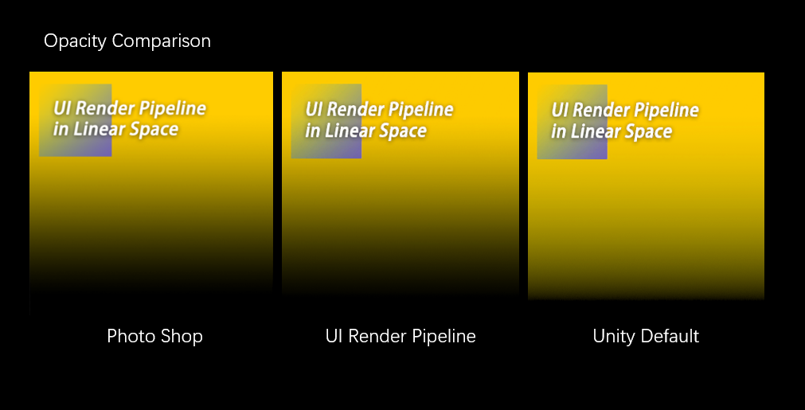
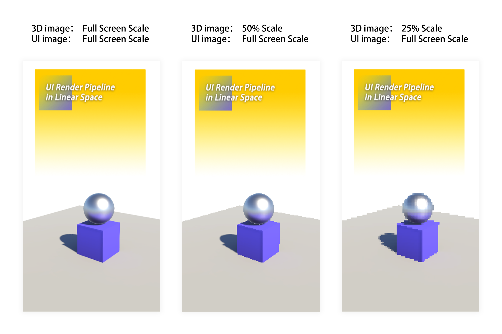
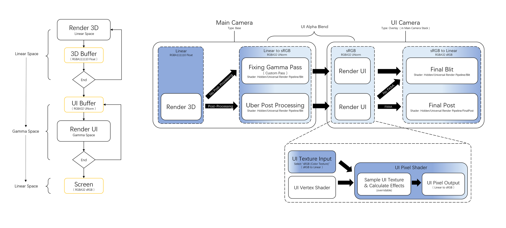
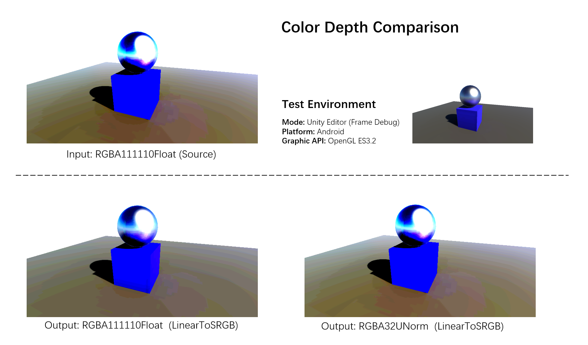

# UniversalRP 自定义渲染管线 DEMO

#   

此项目方案是根据 完美技术TA TakeshiCho 七块君 (JP) 提供的库为 BASE 进行开发的.. (由于原作者只维护 URP 10.6.0 版, 不考虑其它版本) URP 10 => 12 版本差异巨大 所以这里创建独立的库 以支持 (URP 12.x.x) 高版本..

#   

这个项目是一套基于 Unity UniversalRP 的 UI 渲染管线 和 Shader 框架, 为了修复线性色彩空间中的 UI 切图的透明度错误,
能够让 UI 设计师在 Unity 中保持原有的 sRBG 工作流.

* [UICamera => Gamma]    <=>   [SceneCamera => Linear]

### Warning:
* Forward Renderer Data => Transparent Layer Mask 必须去掉 "UI" Layer Mask , 否则 UI 会被 DrawTransparentObjects 和 UGUI 这两个 Pass 重复绘制.

### Feature:
* In our Render Pipeline,the UI images have the same opacity with images which are in the PhotoShop.

* UI Render with Individual resolution.

  
  

### Update:
* 11 / 05 / 2021:  
  Supported correct UI alpha gamma in case of Post-Processing;  
  Fixed the wrong effects of baked Reflection Probe;  
  Fixed the Gamma in Scene view;  
  
  
* 11 / 06 / 2021:   
  Supported correct UI alpha gamma in case of FXAA;  
 
  
* 11 / 12 / 2021:  
  Fixed the Color Depth resolution of 3D render.  
  
  
* 11 / 19 / 2021:  
  Fixed the the wrong effects of Reflection Probe in scene view.  
  Fixed the the wrong effects of Transparent Objects in scene view.
  
* 11 / 28 / 2021:  
  Supported UI Render with Individual resolution.
  
* 25 / 02 / 2022:  
  Supported URP 12.1.4+

* 19 / 03 / 2022:  
  Supported URP 12.1.6+
  
* 05 / 23 / 2022:  
  Changed the UI Render Target.

### Plan:
* To Develop Camera Managing Script. 

# Pipeline Flowchart

## Why using *RGBA32 UNorm* for the UI Buffer
When the final 3D render image is blit into the UI buffer, and transform to the Gamma Space, 
we can compare the resolutions of Color Depth in different graphics format of the UI Buffer.
Evidently the RGBA32 UNorm has the more details.  

